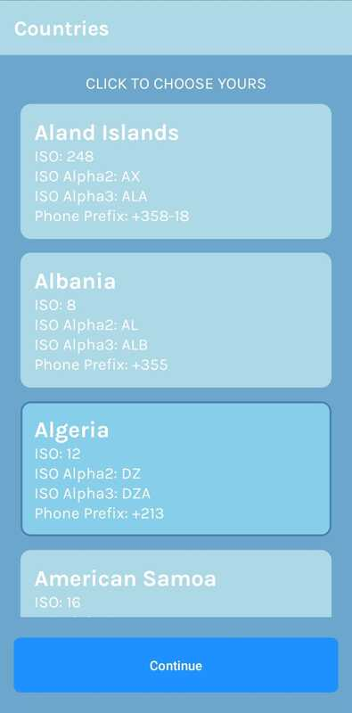
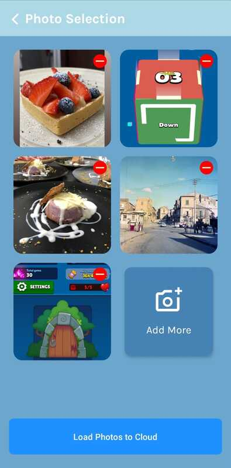

# CloudShareSnap

CloudShareSnap is a mobile application built using the MVVM architecture, developed with Jetpack Compose and Material3. The app allows users to perform a series of steps: selecting a country, uploading images from the local gallery, and copying URLs for uploaded images.

## App Icon

## App Screen

## App Phases

1. The user selects their country from a list of available countries during app opening (refer to point 1 of "Documentation" for details).
2. In the second step, users choose images from their local gallery. Once selected, they can proceed to the upload phase.
3. After the upload is complete, users can copy URLs from a list. Each URL corresponds to an uploaded image.

## Libraries Used

The app utilizes the following libraries, each contributing to its functionality:

- **Core Splash Screen**: Implementation for a dynamic app launch screen.
- **Compose**: UI toolkit for building native user interfaces, including Material3 components.
- **Navigation**: For in-app navigation between different screens.
- **Hilt**: Dependency injection framework for simplified app architecture.
- **Timber**: Logging library for better debugging.
- **Accompanist Permissions**: Simplifies handling runtime permissions.
- **Network**: Retrofit and OkHttp for network requests and interaction.
- **Coil**: Image loading library for handling images.
- **Tests**: JUnit, Mockito, and other testing libraries for ensuring app stability.

For a full list of dependencies and their versions, refer to the `build.gradle` file.

## Image Uploading Strategies

The image uploading process in CloudShareSnap is designed for efficiency, user experience, and optimal data transfer. Several strategies are employed to achieve these goals:

### Image Compression

Before uploading, images are compressed to reduce their size without compromising quality. This not only speeds up the upload process but also saves bandwidth. CloudShareSnap uses an `ImageCompressor` interface to handle compression. The default implementation, `DefaultImageCompressor`, converts images to JPEG format with a compression level of 80%.

### Progressive Upload and Chunking

Images are uploaded progressively by dividing them into smaller chunks. This approach ensures a smoother user experience, as the app can display progress as each chunk is uploaded. Additionally, if a large image fails to upload entirely, only the remaining chunks need to be resent, reducing the risk of data loss.

### JPEG Format

JPEG format is utilized for image uploads due to its efficient compression and widespread compatibility. It strikes a balance between file size and image quality, making uploads faster and less data-intensive.

### Parallel Uploads

To optimize the upload process, CloudShareSnap performs image uploads in parallel. This means that multiple images can be uploaded simultaneously, reducing the overall upload time and providing a faster user experience.

## Testing

CloudShareSnap includes a comprehensive testing suite to ensure its reliability and functionality. Three types of tests have been implemented:

1. **UseCase Tests**: These tests focus on validating the behavior of individual UseCase components. UseCase tests ensure that business logic and data manipulation are working as expected.

2. **ViewModel Tests**: ViewModel tests check the interaction between the ViewModel and the UI components. These tests ensure proper data handling, view state management, and communication with UseCase components.

3. **API Tests with MockWebServer**: CloudShareSnap employs MockWebServer to simulate network responses and interactions. These tests ensure that API calls are handled correctly, response parsing is accurate, and the app responds appropriately to different scenarios.

The testing suite enhances the quality of the app, helps catch bugs early in the development process, and contributes to maintaining a stable and reliable codebase.

## Continuous Integration and Deployment

A basic CI/CD setup has been provided using GitLab CI/CD. The `.gitlab-ci.yml` file defines the stages of building, testing, and deployment. The pipeline includes the following stages:

1. **Build**: Assembles the app.
2. **Test**: Runs unit tests and other relevant tests.
3. **Deploy to Staging**: Deploys the app to the staging server.
4. **Deploy to Production**: Deploys the app to the production server.

Deployment to production only occurs when code is pushed to the `master` branch. This setup can be customized further to suit your project's specific needs.

## Getting Started

To run the app locally, follow these steps:

1. Clone this repository.
2. Open the project in Android Studio.
3. Build and run the app on a device or emulator.

For more in-depth information on using the app, refer to the detailed documentation included in the project.

## Contributing

Contributions are welcome! If you'd like to contribute to CloudShareSnap, please follow the standard GitHub Fork and Pull Request workflow.

## License

This project is licensed under the MIT License - see the [LICENSE](LICENSE) file for details.
